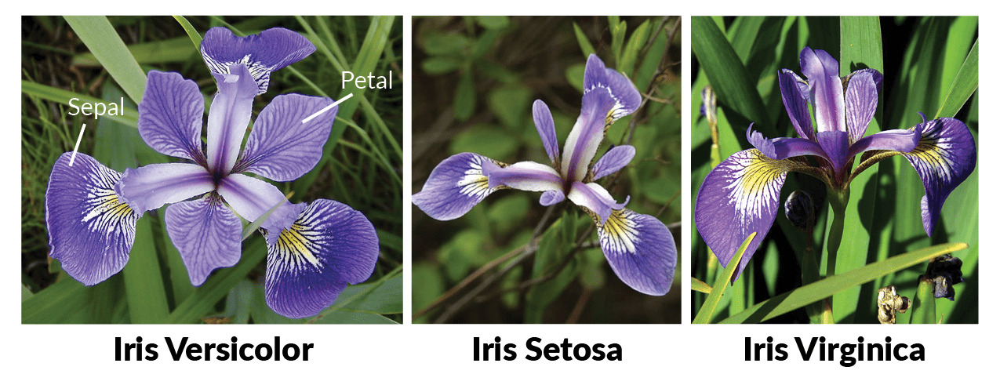

 **CODESOFT Internship Projects**

 **Project 1:** Iris Flower Classification

**Problem Statement:**
Utilizing the Iris flower dataset, which comprises three species - setosa, versicolor, and virginica, distinguishable by their measurements, the task is to develop a machine learning model capable of accurately classifying Iris flowers into their respective species. By leveraging the sepal and petal measurements provided in the dataset, the objective is to train a model that can effectively classify Iris flowers, thus serving as an introductory classification task widely used in machine learning.

 **Goal:**
The goal is to develop a machine learning model that accurately classifies Iris flowers into their respective species based on their sepal and petal measurements, using the Iris dataset as an introductory classification task in machine learning.

---

**Project 2: Sales Prediction**

Problem Statement:
Sales prediction in business involves forecasting the volume of product purchases by customers, considering factors like advertising expenditure, target audience segmentation, and advertising platform selection. Data scientists play a pivotal role in this process by utilizing machine learning techniques in Python to analyze and interpret data, enabling informed decisions regarding advertising costs. By leveraging predictive models, businesses can optimize their advertising strategies and maximize sales potential, thereby necessitating a comprehensive exploration of sales prediction using machine learning in Python.

**Goal:**
The business goal is to optimize advertising strategies and maximize sales potential through accurate sales prediction using machine learning techniques in Python.

---

 **Project 3: Titanic Survival Prediction**

 **Problem Statement:**
Develop a predictive model using the Titanic dataset to determine the likelihood of a passenger surviving the sinking of the Titanic. Utilizing information such as age, gender, ticket class, fare, and cabin, the model aims to accurately classify passengers into survived or not survived categories. This project serves as a fundamental exercise in data analysis and predictive modeling, offering insights into the factors influencing survival rates aboard the Titanic.

 **Goal:**
The goal is to create a predictive model using the Titanic dataset to accurately determine whether a passenger survived or not based on various attributes.

---

In these projects, we aim to:
- Utilize machine learning techniques to solve real-world problems.
- Explore and analyze datasets to gain insights into the underlying patterns.
- Train predictive models to make accurate predictions.
- Evaluate model performance using appropriate metrics.
- Provide valuable insights and recommendations based on the results.

**Tools and Technologies Used:**
- Python
- Scikit-learn
- Pandas
- NumPy
- Matplotlib

**Project Structure:**
- **Data Exploration:** Understand the structure and characteristics of the datasets.
- **Data Preprocessing:** Handle missing values, encode categorical variables, and scale numerical features.
- **Model Building:** Train machine learning models using the preprocessed data.
- **Model Evaluation:** Assess model performance using appropriate evaluation metrics.
- **Conclusion:** Summarize findings and insights from the projects.

**References:**
- Scikit-learn Documentation: [https://scikit-learn.org/stable/documentation.html](https://scikit-learn.org/stable/documentation.html)
- Pandas Documentation: [https://pandas.pydata.org/docs/](https://pandas.pydata.org/docs/)
- Matplotlib Documentation: [https://matplotlib.org/stable/contents.html](https://matplotlib.org/stable/contents.html)
- NumPy Documentation: [https://numpy.org/doc/](https://numpy.org/doc/)

Each project provides valuable learning experiences in data analysis, machine learning modeling, and predictive analytics, contributing to the overall skill development and expertise in the field of data science.
